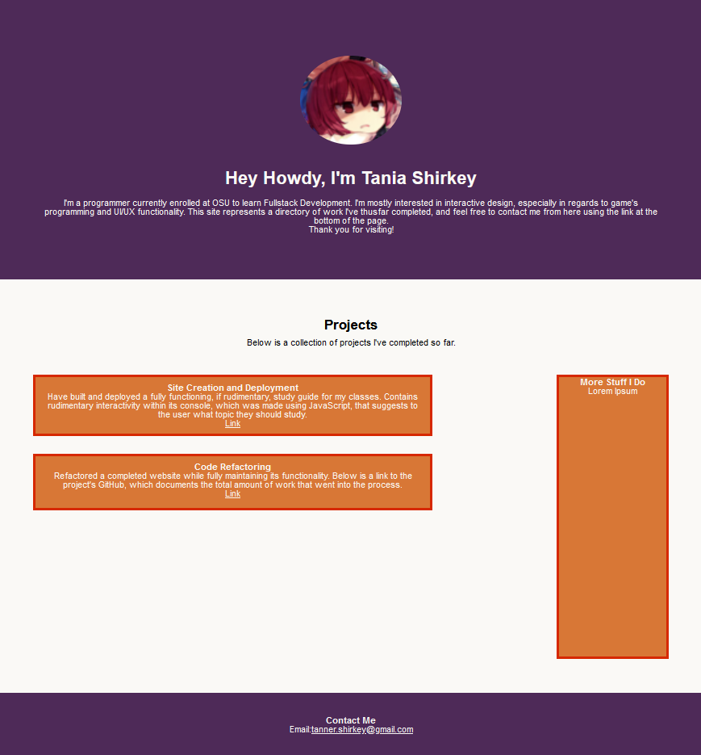

# Prework Study Guide Webpage

## Description

While being deployed for a homework assignment, this site is my in-progress attempt at an online, living portfolio. 

As an assignment, I was tasked with constructing a functional single-page website with advanced CSS techniques. I got really tripped up with CSS, though, so while I did begin this project with an ambitious goal it sadly has not yet come to its full potential. This was mostly caused by frustration with trying to apply CSS on my own, particurarly with trying to, and failing, to have the current layout work with Flexbox. While I did end up using Grid layout, a lot of time was still spent on trying to make Flexbox work where it really couldn't.

This is not to say that building the site was purely arduous, once I had figured out the path I'd take with the layout, working with CSS became much easier. I'm really, genuinely glad I had this hiccup too, since it has left me with a much clearer understanding of CSS, especially with its syntax and general format. 

In terms of complex CSS I *was* able to implement, I am glad I had the time to add rudimentary mobile support with a media query, as well as implementing the :hover functionality. I am very excited to get back to the site later as well to full flesh it out on my own time.

## Usage

The page is meant to be a directory of my professional ability, so I designed it primarily as a central location for people to view my work. In this sense, the site's body displays articles with basic summaries of that work followed by a link that one could use to easily navigate to the deployed pages.

I've had the links open in new tabs as well so that users can return to the main page to check out my other work.

Finally, my contact email is linked in the footer so that interested users may contact me for business inquiries. I figure that would be appropriate if I wanted the site to function not just as a directory but also a digital resume. 

## Features

Very basic interactivity using :hover.

Rudimentary compatibility for mobile devices using a media query.

Functioning links with additional security to prevent tabnabbing.

## How to Contribute

Feel free to push up refactors or suggestions. You may demonstrate any change suggestions as well by downloading the code and pushing. In this way I can see what changes are being suggested and can respond accordingly.
